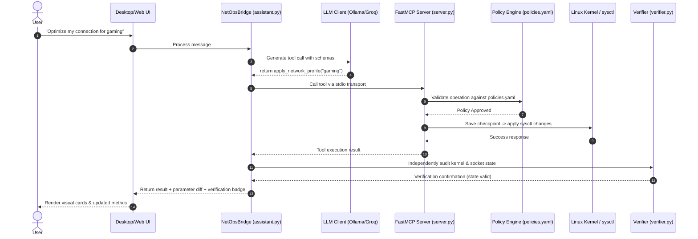

# NetOps MCP Assistant: System Architecture

**Course Project:** CS331 — Computer Networks  
**Team ID:** T018  

---

## 1. Overview & Architectural Philosophy

The **NetOps MCP Assistant** is designed with a strict, defense-in-depth architectural principle: **The LLM is strictly an intent interpreter, never a security authority.**

AI models are probabilistic and vulnerable to prompt injection or hallucination. Therefore, the system enforces a strict process boundary between the natural language reasoning layer and the privileged operating system layer using the **Model Context Protocol (MCP)** and a deterministic policy engine.

```
┌─────────────────────────────────────────────────────────────────────────┐
│                        User Interface Layer                             │
│     • Desktop GUI (pywebview)  /  Web Browser (Flask HTTP API)          │
│     • Live Subsystem Health Cards  /  Real-time Benchmark Visualization │
└────────────────────────────────────┬────────────────────────────────────┘
                                     │ User prompt (Natural Language)
                                     ▼
┌─────────────────────────────────────────────────────────────────────────┐
│                 Orchestrator Bridge (assistant.py)                      │
│     • NetOpsBridge coordinates LLM, MCP, and Verification pipelines     │
└──────────────────┬──────────────────────────────────┬───────────────────┘
                   │                                  │
                   ▼ Intent query                     ▼ Structured tool call
┌───────────────────────────────────────┐  ┌──────────────────────────────┐
│       LLM Client (llm_client.py)      │  │  MCP Client (mcp_client.py)  │
│  • Provider: Groq API (Low-latency)   │  │  • FastMCP stdio transport   │
│  • Structured tool schema generation  │  │  • Asynchronous JSON-RPC     │
└───────────────────────────────────────┘  └──────────────┬───────────────┘
                                                          │ stdio stream
                                                          ▼
┌─────────────────────────────────────────────────────────────────────────┐
│                    FastMCP Server Layer (server.py)                     │
│  ┌───────────────────────────────────────────────────────────────────┐  │
│  │                    Policy Validation Engine                       │  │
│  │   • Reads rules/policies.yaml                                     │  │
│  │   • Protected Ports: 22 (SSH), 53 (DNS), 5000 (UI/Agent)          │  │
│  │   • Protected Interfaces: eth0, lo (No bandwidth throttling)      │  │
│  └─────────────────────────────────┬─────────────────────────────────┘  │
│                                    │ Approved calls only                │
│                                    ▼                                    │
│  ┌───────────────────────────────────────────────────────────────────┐  │
│  │                     System Execution Tools                        │  │
│  │   • tools/net_ops.py: iptables, tc, ss, ping                      │  │
│  │   • tools/profiles.py: kernel sysctl tuning & checkpointing       │  │
│  │   • tools/benchmark.py: ping & iperf3 empirical metrics           │  │
│  │   • Array-based subprocess execution (Zero shell=True)            │  │
│  └───────────────────────────────────────────────────────────────────┘  │
└────────────────────────────────────┬────────────────────────────────────┘
                                     │
                                     ▼
┌─────────────────────────────────────────────────────────────────────────┐
│              Independent Verification Engine (tools/verifier.py)        │
│     • Actively probes live socket connectivity (TCP handshake)          │
│     • Inspects kernel tables directly to prove change application       │
│     • Compares before/after sysctl states                               │
└─────────────────────────────────────────────────────────────────────────┘
```

---

## 2. Detailed Subsystem Breakdown

### 2.1 User Interface Layer (`ui/` and `app.py`)
* **Technology:** HTML5, modern Vanilla CSS (slate/dark theme with glassmorphism), responsive JavaScript.
* **Packaging:** 
  * Desktop Mode: Embedded native desktop window using `pywebview`.
  * Web Mode: Local lightweight HTTP server on port 5000 (`python app.py --web`).
* **Subsystem Monitoring:** Displays real-time connection status cards for the LLM Provider, the FastMCP Server, and the Operating System Kernel.

### 2.2 Orchestration Bridge (`assistant.py`)
* Encapsulated in the `NetOpsBridge` class.
* Manages conversation history and transforms user prompts into structured tool executions.
* If an operation mutates kernel or firewall state, `assistant.py` automatically invokes the independent verifier and packages both the tool output and the verification audit into a unified response for the UI.

### 2.3 LLM Reasoning Layer (`llm_client.py`)
* **Active Engine — Groq API:** Ultra-fast cloud inference powered by Groq LPUs (`llama-3.3-70b-versatile` or `openai/gpt-oss-120b`) delivering sub-second intent reasoning without taxing local CPU/GPU hardware.
* **Tool Calling Grammar:** Exposes formal JSON Schema specifications of all available FastMCP tools to the model.

### 2.4 Authoritative FastMCP Server (`server.py`)
* Built with Python `FastMCP`.
* Communicates exclusively via standard I/O (`stdio`) over JSON-RPC 2.0.
* Registers all 12 operational and diagnostic tools.
* Acts as the gatekeeper: inspects tool arguments against `rules/policies.yaml` before passing them to the execution layer.

### 2.5 Policy & Security Engine (`rules/policies.yaml`)
Declarative policy definitions enforce system safety:
* **Never-Block Ports:** Ports `22` (SSH), `53` (DNS), and `5000` (Management) cannot be dropped or rejected under any circumstance.
* **Protected Network Interfaces:** `eth0` and `lo` are protected from disruptive bandwidth limits.
* **Input Sanitization:** Port numbers, IP addresses, and rate limits are strictly validated against regexes and numerical ranges prior to command construction.
* **No Shell Execution:** Commands are dispatched strictly via argument lists (`["sysctl", "-w", key=val]`), completely preventing command injection.

### 2.6 Workload Optimization & Checkpointing (`tools/profiles.py`)
* Provides predefined profiles tailored for specific network workloads:
  * **Gaming:** `bbr` congestion control, `fq_codel` anti-bufferbloat queuing, reduced `tcp_fin_timeout` (15s), `tcp_fastopen = 3`.
  * **Streaming:** High receive window autotuning (`tcp_rmem` up to 16MB), `fq` pacing, disabled `tcp_slow_start_after_idle`.
  * **Broadcasting:** High send window autotuning (`tcp_wmem` up to 16MB), `bbr` pacing, expanded ephemeral port range (1024–65535).
* **Automatic Checkpointing:** Before any parameter is written to `/proc/sys/net/`, current values are saved to `/app/results/checkpoint.json`.
* **Instant Rollback:** Calling `restore_network_defaults()` restores the saved parameters with zero host downtime.

### 2.7 Independent Dual-Layer Verifier (`tools/verifier.py`)
A fundamental principle of reliable network engineering is independent verification:
1. **Kernel Table Inspection:** Confirms that the requested `iptables` rule or `sysctl` parameter exists in the active kernel state.
2. **Active Socket Probing:** Opens a TCP socket connection against the target port to test whether traffic is truly accepted or rejected.

---

## 3. End-to-End Request Lifecycle



---

## 4. Codebase Directory Map

```text
CS331-T018-NetworkConfigAssit/
├── CS331_T018_Project_Report.md  # Comprehensive course project report
├── ARCHITECTURE.md               # System architecture specification (this file)
├── README.md                     # Main project documentation & run instructions
├── README_GITHUB.md              # GitHub-formatted setup guide
├── .gitignore                    # Git tracking exclusions
│
└── netops-mcp-assistant/         # Core application directory
    ├── app.py                    # Application entrypoint (Desktop GUI / Web server)
    ├── assistant.py              # NetOpsBridge coordinating LLM & FastMCP
    ├── llm_client.py             # LLM provider integration & prompt engineering
    ├── mcp_client.py             # FastMCP stdio client session manager
    ├── server.py                 # FastMCP server exposing 12 tools & policy check
    ├── compose.yaml              # Docker Compose multi-service definition
    ├── Dockerfile                # Linux container with network tools & Ollama
    ├── docker-entrypoint.sh      # Container bootstrap & Ollama model downloader
    │
    ├── rules/
    │   └── policies.yaml         # Declarative security policy rules
    │
    ├── tools/
    │   ├── net_ops.py            # Linux networking commands (iptables, tc, ss)
    │   ├── profiles.py           # Kernel tuning profiles & checkpoint/rollback
    │   ├── benchmark.py          # Real-time ping & iperf3 benchmark runner
    │   ├── plots.py              # Matplotlib visualization generators
    │   └── verifier.py           # Independent dual-layer verification engine
    │
    ├── ui/
    │   ├── index.html            # Web/Desktop interface markup
    │   ├── styles.css            # Dark/slate modern design system
    │   └── app.js                # Frontend state management & event handlers
    │
    ├── demo/
    │   ├── validate_firewall.py  # Standalone firewall demonstration script
    │   ├── demo_server.py        # Background socket listener for testing
    │   └── stop_demo.py          # Demo process cleanup
    │
    └── tests/
        ├── test_policies.py      # Unit tests for protected ports & ranges
        ├── test_mcp_tools.py     # FastMCP tool registration tests
        └── test_assistant.py     # End-to-end assistant integration tests
```
